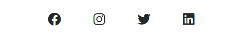

# FIRENZE HOUSING

## Static Front-End Website 

* This project was created for educational purposes within the scope of **Code Institute's Diploma in Full Stack Software Developer** course.

Firenze Housing is a small company that offers quality and affordable rental apartments, rooms and storage services for students studying in Florence. The purpose of this site is to market Firenze Housing's services to the user by providing easy-to-access, detailed and easy-to-understand information about the flat, room or storage service they are interested in. This project requires the use of HTML and CSS, the core technologies I have learned so far.

**For the live project page >>>** [Firenze Housing](https://mika-sims.github.io/firenze-housing/)   
   
       

# Table of Contents 

## Contents
- [User experience](#user-experience)
  * [User Stories](#user-stories)
    + [Prospective Customer](#prospective-customer)
    + [Website Owner](#website-owner)
  * [Wireframes](#wireframes)
- [Design](#design)
  + [Colour Scheme](#colour-scheme)
  + [Typography](#typography)
  + [Imagery](#imagery)
  + [Icons and Illustrations](#icons-and-illustrations)
  + [Logo and Favicon](#logo-and-favicon)
- [Structure](#structure)
  + [Navigation Bar](#navigation-bar)
  + [Sub Navigations](#sub-navigations)
  + [Footer](#footer)
  + [404 Page](#404-page)
- [Technologies used](#technologies-used)
  + [Languages Used](#languages-used)
  + [Frameworks Libraries and Programs](#frameworks-libraries-and-programs)
- [Testing](#testing)
- [Deployment](#deployment)
- [Credits](#credits)

# User experience

## User Stories

### Prospective Customer

  **For apartments and rooms;**

 - As a Firenze Housing website user, I would like to see pictures and prices of available apartments and rooms
 - As a Firenze Housing website user, I would like to see detailed descriptions of available apartments and rooms
 - As a Firenze Housing website user, I would like to see the office location of Firenze Housing
 - As a Firenze Housing website user, I would like to see detailed contact information of Firenze housing

 **For storage services;**

 - As a Firenze Housing website user, I would like to know if there is a storage service in cases where I do not want to pay the rent (holiday, trip, etc.)
 - As a Firenze Housing website user, I would like to see a detailed explanation of how the storage service is provided

### Website Owner

- As a website owner, I want the website to be accessible and user friendly from all devices
- As a website owner, I want users to easily reach the service they want to reach while using the website
- As a website owner, I want contact information and social media links accessible to increase business visibility

## Wireframes

Before the website was created, the wireframes were designed with the wireframe design tool Balsemiq. A number of distinct differences emerged between the wireframe design and the final website design. One of the reasons is that a simpler design idea has emerged than the wireframe design. 

- Instead of creating a separate page for the storage service section, information about the content of this service had been added to the end of the services page before the find us section

- In addition, the idea of recreating the page navigation in the footer was canceled after the design of the fixed navigation menu

Wireframes design fils can be find at [Wireframe](assets/images/wireframes) image folder

# Design

A minimal color scheme and typography have been chosen to create a simple, eye-catching and impressive design

## Colour Scheme

   

- The two main colors in the logo design are used throughout the site to separate sections and objects from each other. The dark shade of green-cyan color with **#006161** hex code is densely used in the background and title text of the main sections. In addition, the colors of these illustrations have been adjusted accordingly in order to ensure that the illustrations in different sections are compatible with the page layout

- The second main color, **#ff8749** hex coded medium light shade of orange, is mostly used to highlight the buttons. This choice was made because it is a more attractive color than the dark green color

- Aquamarine with the **#7fffd4** hex code is used to highlight the price and booking buttons in the services section

- Black color is used in the general font and icons of the site

## Typography

- In order to have a simple design, two fonts are used. Syncopate was used for the main title and sub-titles, and Serif was used as its fallback. In order to attract attention to the main headings,underline decoration was applied. This is not implemented in the subheadings

- All remaining sections of the website (navigation menu, descriptions, etc.) use Yanone Kaffeesatz and Sans-serif as fallback font.

## Imagery

- The source of all images used on the website is [Unsplash](https://link-url-here.org).

- The imags have been carefully chosen to be compatible with the concept of the site. The main page image is a plain image in content in order to preserve the simplicity of the site

- The image of Ponte Vecchio, one of the most famous location of Florence, is used in the background of the About Us section

- In addition, the images used in the presentation of the rented apartments and rooms have been chosen to describe the service itself

## Icons and Illustrations

- All the icons in the services section and in the rental apartments and rooms section are selected from the free icons on the [Font Awesome](https://fontawesome.com/) site

- All illustrations used in the Find Us section and the Storage service section of the site have been downloaded as PNG from the [Storyset](https://storyset.com/) site. Attribute is made to Storyset in the index.html file

## Logo and Favicon

- All logos on the site as well as the favicon in the browser bar are designed by using [Figma](https://www.figma.com/)

   

- The roof shape was placed over the Firenze Housing lettering, creating a simple yet descriptive navigation logo design for the website's content

- A simple but descriptive home page logo was created by placing the letter "F" inside the house shape, which determines the content of the site

- A simple favicon design has been obtained by enclosing the first letters of the words in Firenze Housing company in the shape of a circle with a white background

# Structure 

The site consists of index.html, services.html, contact.html pages. 

- Home page (index.html) is the main page and when we scroll down, a subsection called services is seen. There are icons and short-explanatory texts that provide the transition from this section to the specific services section. When we continue to scroll down, the About Us section appears. In this section, there is a text describing the mission and vision of Firenze Housing. At the end of this page, there is a Find Us section with contact information. This section contains detailed information on how to contact Firenze Housing.

- On the Services (services.html) page, there are detailed information about rental apartments, room and storage services, and pictures of rental apartments and rooms.

- On the Contact (contact.html) page, there is a form that allows the user to contact Firenze Housing for the requested service. When the form is filled and the request is sent, a new page opens with the message 'Thank you for the service request'.

## Navigation Bar

The Navigation menu is fixed at the top of all pages to provide the user with easy navigation between the pages. In order to determine which page the user is currently on, there is an orange under-line effect under the name of the current page.

- On screens with 719 px and below, the logo goes over the navigation menu links.

## Sub navigations

- The "Contact Us" sub-navigation on the main page is for quickly directing the user to the contact form.

- The 4 icons in the services section of the home page quickly guide the user to the desired service section. In the desktop version, when the user hover over any of these icons, the color of the icon changes.

   

- When the services section in the navbar menu is clicked, a detailed explanation about the service types offered is displayed on the new page that opens. The "Book Now" and "INFO" sub-navigations on the pictures and illustrations direct the user to the contact form where they can contact Firenze Housing and request the desired service.

## Footer

- At the bottom of all independent pages, there are icons of social media accounts that direct the user to Firenze Housing's social media accounts. As soon as one of these icons is clicked, the social media account is opened in a new tab.