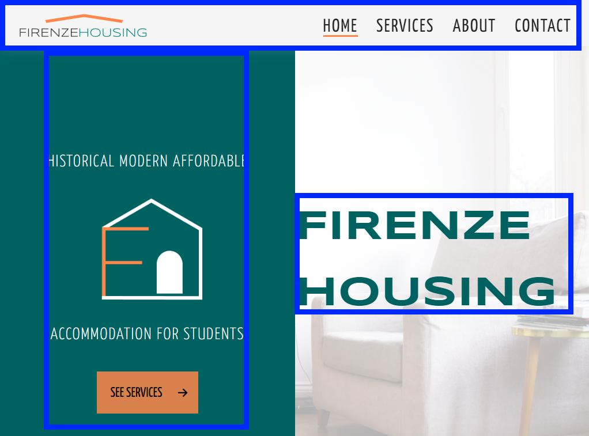
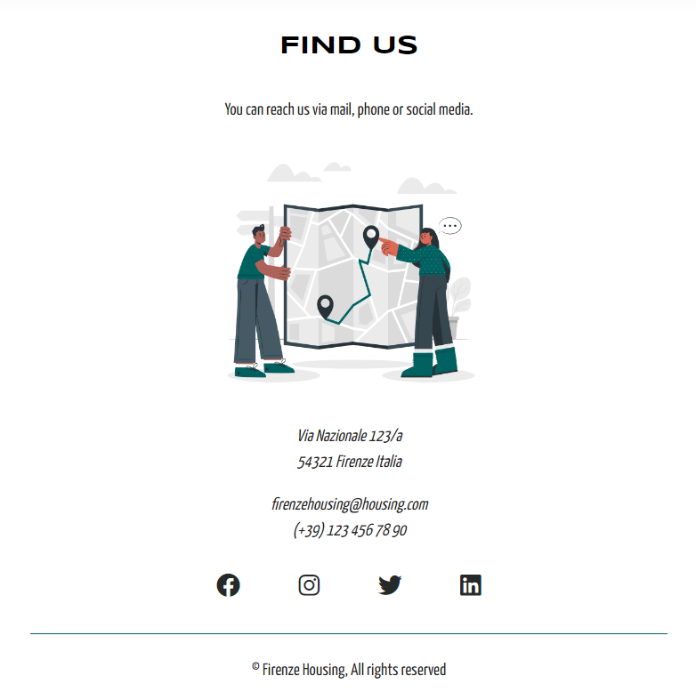
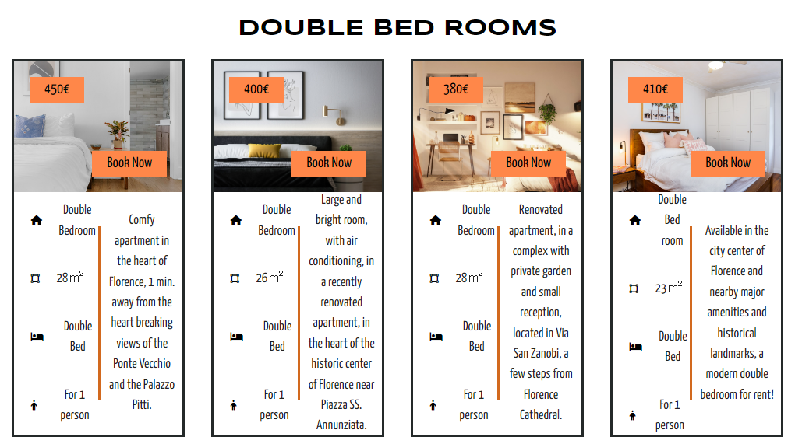
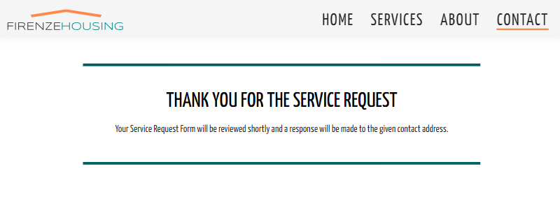

# FIRENZE HOUSING

## Static Front-End Website 

* This project was created for educational purposes within the scope of **Code Institute's Diploma in Full Stack Software Developer** course.

Firenze Housing is a small company that offers quality and affordable rental apartments, rooms and storage services for students studying in Florence. The purpose of this site is to market Firenze Housing's services to the user by providing easy-to-access, detailed and easy-to-understand information about the flat, room or storage service they are interested in. This project requires the use of HTML and CSS, the core technologies I have learned so far.

**For the live project page >>>** [Firenze Housing](https://mika-sims.github.io/firenze-housing/)   
   
       

# Table of Contents 

## Contents
- [**User experience**](#user-experience)
  * [User Stories](#user-stories)
    + [Prospective Customer](#prospective-customer)
    + [Website Owner](#website-owner)
  * [Wireframes](#wireframes)
  * [Design](#design)
    + [Colour Scheme](#colour-scheme)
    + [Typography](#typography)
    + [Imagery](#imagery)
    + [Icons and Illustrations](#icons-and-illustrations)
    + [Logo and Favicon](#logo-and-favicon)
  * [Structure](#structure)
    + [Navigation Bar](#navigation-bar)
    + [Sub Navigations](#sub-navigations)
    + [Footer](#footer)
- [**Features**](#features)
  * [Home Page](#home-page)
    + [Navigation Menu](#navigation-menu)
    + [Services Section at Main Page](#services-section-at-main-page)
    + [About Us](#about-us)
    + [Find Us](#find-us)
  * [Services](#services)
  * [Contact](#contact)
  * [Formdump Page](#formdump-page)
- [**Technologies Used**](#technologies-used)
- [**Testing**](#testing)
- [**Deployment**](#deployment)
- [**Credits**](#credits)
- [**Acknowledgements**](#acknowledgements)

# User experience

- ## User Stories

### Prospective Customer

  **For apartments and rooms;**

 - As a Firenze Housing website user, I want to be able to navigate the entire site smoothly.
 - As a Firenze Housing website user, I would like to see pictures and prices of available apartments and rooms.
 - As a Firenze Housing website user, I would like to see detailed descriptions of available apartments and rooms.
 - As a Firenze Housing website user, I would like to see the office location of Firenze Housing.
 - As a Firenze Housing website user, I would like to see detailed contact information of Firenze housing.

 **For storage services;**

 - As a Firenze Housing website user, I would like to know if there is a storage service in cases where I do not want to pay the rent (holiday, trip, etc.),
 - As a Firenze Housing website user, I would like to see a detailed explanation of how the storage service is provided,

### Website Owner

- As a website owner, I want the website to be accessible and user friendly from all devices
- As a website owner, I want users to easily reach the service they want to reach while using the website
- As a website owner, I want contact information and social media links accessible to increase business visibility

[Back to contents](<#contents>)

- ## Wireframes

Before the website was created, the wireframes were designed with the wireframe design tool [Balsamiq](https://balsamiq.com/). A number of distinct differences emerged between the wireframe design and the final website design. One of the reasons is that a simpler design idea has emerged than the wireframe design. 

- Instead of creating a separate page for the storage service section, information about the content of this service had been added to the end of the services page before the find us section.

- In addition, the idea of recreating the page navigation in the footer was canceled after the design of the fixed navigation menu.

Wireframes design fils can be find at [Wireframe](assets/images/wireframes) image folder.

[Back to contents](<#contents>)

- ## Design

A minimal color scheme and typography have been chosen to create a simple, eye-catching and impressive design.

### Colour Scheme

 

- The two main colors in the logo design are used throughout the site to separate sections and objects from each other. The dark shade of green-cyan color with **#006161** hex code is densely used in the background and title text of the main sections. In addition, the colors of these illustrations have been adjusted accordingly in order to ensure that the illustrations in different sections are compatible with the page layout.

- The second main color, **#ff8749** hex coded medium light shade of orange, is mostly used to highlight the buttons. This color i also used to highlight the price and booking buttons in the services section. This choice was made because it is a more attractive color than the dark green color.

- Black color is used in the general font and icons of the site.

[Back to contents](<#contents>)

### Typography

- In order to have a simple design, two fonts are used. Syncopate was used for the main title and sub-titles, and Serif was used as its fallback.

- All remaining sections of the website (navigation menu, descriptions, etc.) use Yanone Kaffeesatz and Sans-serif as fallback font.

[Back to contents](<#contents>)

### Imagery

- The source of all images used on the website is [Unsplash](https://link-url-here.org).

- The imags have been carefully chosen to be compatible with the concept of the site. The main page image is a plain image in content in order to preserve the simplicity of the site.

- The image of Ponte Vecchio, one of the most famous location of Florence, is used in the background of the About Us section.

- In addition, the images used in the presentation of the rented apartments and rooms have been chosen to describe the service itself.

[Back to contents](<#contents>)

### Icons and Illustrations

- All the icons in the services section and in the rental apartments and rooms section are selected from the free icons on the [Font Awesome](https://fontawesome.com/) website.

- All illustrations used in the Find Us section and the Storage service section of the site have been downloaded as PNG from the [Storyset](https://storyset.com/) site. Attribute is made to Storyset in the index.html file.

[Back to contents](<#contents>)

### Logo and Favicon

- All logos on the site as well as the favicon in the browser bar are designed by using [Figma](https://www.figma.com/)

   

- The roof shape was placed over the Firenze Housing lettering, creating a simple yet descriptive navigation logo design for the website's content.

- A simple but descriptive home page logo was created by placing the letter "F" inside the house shape, which determines the content of the site.

- A simple favicon design has been obtained by enclosing the first letters of the words in Firenze Housing company in the shape of a circle with a white background.

[Back to contents](<#contents>)

## Structure 

The site consists of index.html, services.html, contact.html pages. 

- Home page (index.html) is the main page and when we scroll down, a subsection called Services is seen. There are icons and short-explanatory texts that provide the transition from this section to the specific Services section. When we continue to scroll down, the About Us section appears. In this section, there is a text describing the mission and vision of Firenze Housing. At the end of this page, there is a Find Us section with contact information. This section contains detailed information on how to contact Firenze Housing.

- On the Services (services.html) page, there are detailed information about rental apartments, room and storage services, and pictures of rental apartments and rooms.

- On the Contact (contact.html) page, there is a form that allows the user to contact Firenze Housing for the requested service. When the form is filled and the request is sent, a new page opens with the message 'Thank you for the service request'.

[Back to contents](<#contents>)

### Navigation Bar

- The Navigation menu is fixed at the top of all pages to provide the user with easy navigation between the pages. In order to determine which page the user is currently on, there is an orange underline effect below the name of the current page.

  

- On screens with 719 px and below, the logo goes over the navigation menu links.

  

[Back to contents](<#contents>)

### Sub navigations

- The "Services" sub-navigation on the main page is for quickly directing the user to the Services page.

  

- The 4 icons in the services section of the home page quickly guide the user to the desired service section. In the desktop version, when the user hover over any of these icons, the color of the icon changes.

  

- When the Services section in the navbar menu is clicked, a detailed explanation about the service types offered is displayed on the new page that opens. The "Book Now" and "INFO" sub-navigations on the pictures and illustrations direct the user to the contact form where they can contact Firenze Housing and request the desired service.

   

[Back to contents](<#contents>)

- ### Footer

- At the bottom of all independent pages, there are icons of social media accounts that direct the user to Firenze Housing's social media accounts. As soon as one of these icons is clicked, the social media account is opened in a new tab.

[Back to contents](<#contents>)

# Features

The primary purpose of the Firenze Housing website is to provide a simple and purposeful presentation that does not tire the user's eyes. With this in mind, the Firenze Housing website has been developed, which informs the user about the service they want to receive, with a simple but explanatory content.

[Back to contents](<#contents>)

- ## Home Page

According to research by Nielsen Norman Group, a large majority of website users read written content as an F-shape pattern. The home page of Firenze Housing website has also been designed in accordance with this pattern.

**>>>[More](https://uxplanet.org/f-shaped-pattern-for-reading-content-80af79cd3394)** about F-Shaped Pattern for Reading Content

[Back to contents](<#contents>)

  ### Navigation Menu

It is fully responsive, fixed at the top of all pages on the site, and includes links to all pages of the site for ease of navigation in one convenient location. The logo in the navigation menu is a link to the main page.

- Tablet/Desktop Navigation Menu

  

- Mobile Navigation Menu

  

[Back to contents](<#contents>)

### Services Section at Main Page

- When the user scrolls down from the main page, a short text of slogan and four sub-links that lead to the relevant section on the Services page are seen. Michelangelo's Statue of David is placed in the background to be relevant to Firenze and to attract the attention of the user.

  

[Back to contents](<#contents>)

### About Us

- An external page has not been created for the About Us section. The About Us section on the main page can be accessed by clicking 'ABOUT' in the navigation menu or by scrolling down from the main page. In the About Us section, there is a short and concise explanation of Firenze Housing's mission and vision. The picture of the famous Ponte Vecchio bridge in the background was chosen to attract the attention of the users.

  

[Back to contents](<#contents>)

### Find Us

- When the user continues to scroll down, a Find Us section is seen just below the About Us section, at the end of the page, where there are informations about the Firenze Housing's detailed contact information and links to the Firenze Housing's social media accounts.

- Find Us section can be seen at the bottom of all pages.

   

[Back to contents](<#contents>)

## Services 

The Services section in the navigation menu is a direct link  to the services. After clicking this link, the users is directed to a Services page where they can see the advertisements and details on the Firenze Housing website.

On the Services page, the user first sees the information and details about the Rental Apartments.

When users scroll down, they will find detailed information about Single Bed Room, Double Bed Room and Storage services. There is also a Find Us section at the end of the Services page.

- The Book Now and INFO links seen on the sections direct the user to the Contact page to contact Firenze Housing regarding the service they want to receive.

- Single Bed Room Section

- Double Bed Room Section

- Storage Section

[Back to contents](<#contents>)

## Contact

The contact page is a simple page containing the contact form and other contact information about Firenze Housing. Here, the user can request information by entering short information in the contact form and selecting the service for which he/she wants to receive information.

- Some fields of the contact form are required to be filled. The form cannot be submitted before these fields are filled.

[Back to contents](<#contents>)

## Formdump Page

The formdump page can also be seen as the form validation page. The user is directed to this page after filling out the contact form completely and submitting it. The formdump page contains a thank you message and text stating that Firenze Housing will respond as soon as possible.

[Back to contents](<#contents>)

# Technologies Used

- [HTML5](https://html.spec.whatwg.org/multipage/) was used to create the content and structure of the website.

- [CSS3](https://www.w3.org/Style/CSS/) was used to style the website.

- [Balsamiq](https://balsamiq.com/) was used to design the wireframes of the website.

- [Figma](https://www.figma.com/) was used to design the mockup, logo and favicon of the website.

- [Am I Responsive](https://ui.dev/amiresponsive) was used to take screenshots of the website in different screen sizes.

- [Chrome DevTools](https://developers.google.com/web/tools) was used during the development phase of the website for  debugging and responsiveness, and to test performance and accessibility on different screen sizes.

- [Git](https://git-scm.com/) was used as the version control system in the terminal.

- [GitHub](https://github.com/) was used to create store the projec"s repository and track the changes.

- [GitPod](https://www.gitpod.io/) was used as a developer platform for remote development.

- [Google Fonts](https://fonts.google.com/) was used to determine the fonts and to import them via Google Fonts application programming interface (API) link.

- [Font Awesome](https://fontawesome.com/) was used to select the icons and import them with the content delivery network (CDN) link provided.

- [Storyset](https://storyset.com/) was used to select and colorize the illustrations used on the website and to download them.

- [Unsplash](https://unsplash.com/) was used as the image source for the website.

[Back to contents](<#contents>)

# Testing

- Please refer [here](TESTING.md) for more information on testing of the Firenze Housing website.

[Back to contents](<#contents>)

# Deployment

GitHub, GitPod and Git were used in the deployment process of the website. To make the project live the website was deployed to GitHub pages.  The stages of the deployment took place as follows.

   1. I created a repository called firenze-housing by cloning the Code Institute student template for Gitpod. You can see the Code Institute GitPod template for students repo here. >>> [GitPod Student Template](https://github.com/Code-Institute-Org/gitpod-full-template)

   

   2. After cloning the repo, I opened it with GitPod

   

   3. After opening the repo with GitPod, I created the project files and folders using the touch (create new file) and mkdir (create new folder) terminal commands.

   4. After creating the files and folders, I often used the "git add" and "git commit" commands to track the progress of the project and the changes made. When I took a break from work or at the end of the day, I uploaded the content of the work I did with the "git push" command to the GitHub repo.

   5. To make the project live, we click on the Settings tab from the project's GitHub repository. Then, we click on Pages from the navigation menu on the left side of the General page that opens. In the GitHub pages section that appears, we select the "main" branch from the Source section and deploy the page.

  - All stages are explained with the image below.

    

    [Back to contents](<#contents>)

    **How to fork repo**

    1. Go to mika-sims/firenze-residence repository.

    2. In the top right corner of the page, click Fork to create a copy of the original repository with all the commit history in your GitHub Account. Forking will not affect to the original repository.

    

    **Create Local Clone of Repo**

    1. Go to mika-sims/firenze-residence repository.

    2. Click Code section. 

    3. Three different options are offered for cloning. 

       - Clone the repository using HTTPS (We will use this one) 
       - Clone the repository using an SSH key 
       - Clone a repository using GitHub CLI

    4. Open Git Bash in your Integrated development environment (IDE) of choice.

    5. Navigate to the directory where you want the clone to be created.

    6. Type "git clone" and then paste the URL copied from GitHub repo.

    7. Press enter and the local clone will be created.

    

    [Back to contents](<#contents>)

# Credits

 ## Code

 - The code with which we can adjust the opacity of the background image without affecting the text is taken from [MDN](https://developer.mozilla.org/en-US/docs/Web/CSS/background-image)

 - The idea that the SVG file can be used within the `<svg>` tag in HTML is taken from [MDN](https://developer.mozilla.org/en-US/docs/Web/SVG/Element/svg).

 - The code for adding favicon is taken from [w3schools](https://www.w3schools.com/html/html_favicon.asp).

 ## Media

 - All images are taken from [Unsplash](https://unsplash.com/)
 - All illustrations are taken from [Storyset](https://storyset.com/)
 - All icons are taken from [Font Awesome](https://fontawesome.com/)
 - All fonts are imported from [Google Fonts](https://fonts.google.com/)

 [Back to contents](<#contents>)

# Acknowledgements

I would like to thanks;

 - to [Code Institute](https://codeinstitute.net/global/) for course content
 - to my mentor [Precious Ijege](https://www.linkedin.com/in/precious-ijege-908a00168/) for guiding me
 - to [Cuneyt Ergun](https://www.linkedin.com/in/cuneytergun/), who guided me with his ideas
 
 and to Code Institute's Slack community

 - [David Reynolds](https://github.com/FluffyBullet)
 - [Hiwa Awrel](https://github.com/AwrelH/)
 - [Cara Mc Avinchey](https://github.com/CaraMcAvinchey)
 - [Laura Taipale](https://github.com/CozyPlantlady)
 - [Anna Gabain](https://github.com/annagabain/)

 for their comments, ideas and contributions to the development of the project.

 [Back to top](<#contents>)