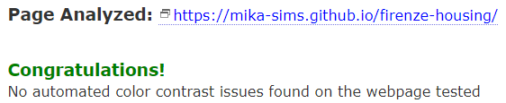
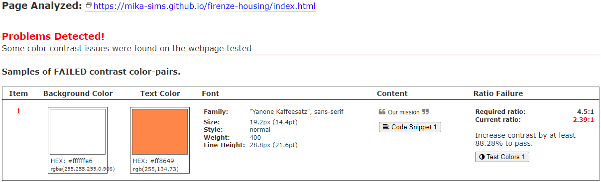
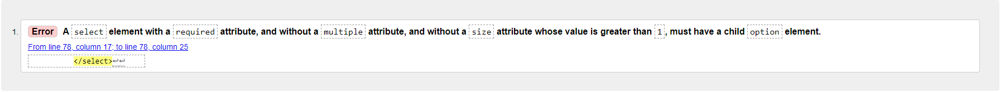

# Testing

  The website has been extensively tested. The following tests were applied during the development.

- [Code Validation](#code-validation)
    * [W3C HTML Validator](#w3c-html-validator) 
    * [W3C CSS Validator](#w3c-css-validator)
- [Lighthouse](#lighthouse)
- [Responsiveness](#responsiveness)
- [Color Contrast Accessibility Validation](#color-contrast-accessibility-validation)
- [Cross-Browser Testing](#cross-browser-testing)
- [Testing User Stories](#testing-user-stories)
    * [Prospective Visitors](#prospective-visitors)
- [Bugs](#bugs-and-debugging)
    * [Resolved](#resolved)
    * [Unresolved](#unresolved)

## Code Validation

All the HTML and CSS codes have been tested in the [W3C html Validator](https://validator.w3.org/) and the [W3C CSS Validator](https://jigsaw.w3.org/css-validator/). There was a minor bug in the contact.html file and it was easily fixed. Details are in the [Bugs](#bugs) section.

### W3C HTML Validator

The main page, services page, contact form page and formdump page have been tested in the W3C HTML validator and below are the screenshots showing the test results.

* Home page

* Services page

* Contact form page

* Formdump page

### W3C CSS Validator

An external stylesheet file is used for all HTML files. Below is the result of the W3C CSS Validator.

## Lighthouse

All pages of the website have been tested separately by Google DevTools' Google Lighthouse tool to learn the Performance, Accessibility, Best Practices and SEO test results for both mobile and desktop. There are minor differences between mobile and desktop tests. The first of these is the Performance test. In mobile and desktop tests, the test results are different due to the difference between the loading times of the pictures. Also, the low performance test results are due to the size of the image files used. The reason why the accessibility test results are at the 93-94 level is that no discernible text has been added to the `<a>` tag because of the SVG file inside the `<a>` tag used as the logo. Below are the test results according to the pages.

**Mobile Test Results**

* Home Page

---

* Services Page

---

* Contact Page

---

* Formdump Page

---
---

**Desktop Test Results**

* Home Page

---

* Services Page

---

* Contact Page

---

* Formdump Page

## Responsiveness

The responsive design tests were carried out manually with [Google Chrome DevTools](https://developer.chrome.com/docs/devtools/).

**Mobile Test**

|        | iPhone 4 | iPhone 5/SE | iPhone 5 | iPhone 6/7/8 | Galaxy S8 | Galaxy S III | Galaxy S9+ | Lumia 520 |
|--------|----------|-------------|----------|--------------|-----------|--------------|------------|-----------|
| Render | passed   | passed      | passed   | passed       | passed    | passed       | passed     |passed     |
| Images | passed   | passed      | passed   | passed       | passed    | passed       | passed     |passed     |
| Links  | passed   | passed      | passed   | passed       | passed    | passed       | passed     |passed     |

---

**Tablet Test**

|        | iPad Mini | iPad Pro | Galaxy Tab S4 | Nexus 7 | iPad Air  | Surface Pro 7 | Surface Duo | Galaxy Fold |
|--------|-----------|----------|---------------|-------- |-----------|---------------|-------------|-------------|
| Render | passed    | passed   | passed        | passed  | passed    | passed        | passed      |passed       |
| Images | passed    | passed   | passed        | passed  | passed    | passed        | passed      |passed       |
| Links  | passed    | passed   | passed        | passed  | passed    | passed        | passed      |passed       |

---

**Desktop Test**

|        | < 1024px | 1024px >  |
|--------|----------|-----------|
| Render | passed   | passed    | 
| Images | passed   | passed    |
| Links  | passed   | passed    |

## Color Contrast Accessibility Validation

The [a11y Color Contrast Accessibility Validator](https://color.a11y.com/) is used to validate the color contrast of the website. During the test phase, the orange text on the main page did not pass the test. Afterwards, the color of the text was changed and it passed the test successfully. Details are in the [Bugs](#bugs) section.

## Cross-Browser Testing

The website was manually tested in Google Chrome, Mozilla Firefox, Microsoft Edge, Apple Safari and Internet Explorer and no bugs were found. All articles and images passed the test without any problems. Appearance, functionality, and responsiveness were consistent across various different sizes and browsers.

## Testing User Stories

### Prospective Visitors

**For apartments and rooms;**

- As a Firenze Housing website user, I want to be able to navigate the entire site smoothly.

    * The navigation menu on all pages is always fixed at the top of the page. This allows the user to easily navigate to the pages they want to go to.

    * With the "Contact Us" button on the main page, user can easily go to the contact form page and contact Firenze Housing.

    * User can easily access Firenze Housing's social media accounts with the social media links in the footer section of the page.

- As a Firenze Housing website user, I would like to see pictures and prices of available apartments and rooms.

    * By clicking on the "Services" section in the navigation menu, the user can see the photos and prices of the apartments and rooms available for rent in the Services section.

- As a Firenze Housing website user, I would like to see detailed descriptions of available apartments and rooms.

    * By clicking on the "Services" section in the navigation menu, the user can see the detailed descriptions of the apartments and rooms available for rent in the Services section.

- As a Firenze Housing website user, I would like to see the office location of Firenze Housing.

    * The user can easily reach the office location of Firenze Housing from the "Find Us" section at the bottom of all pages.

 - As a Firenze Housing website user, I would like to see detailed contact information of Firenze housing.

    * The user can easily see detailed contact information of Firenze housing from the "Find Us" section at the bottom of all pages.

     **For storage services;**

 - As a Firenze Housing website user, I would like to know if there is a storage service in cases where I do not want to pay the rent (holiday, trip, etc.).

    * The user can see that Firenze Housing offers storage services both from the description in the services section on the homepage and from the illustrations at the end of the services page.

 - As a Firenze Housing website user, I would like to see a detailed explanation of how the storage service is provided.

    * The user can have information about how this service is implemented from the storage service section of the services page.

## Bugs and Debugging

During the development of the website, some minor bugs appeared due to misspellings and they were immediately debugged. Tests conducted towards the end of the development of the website revealed some minor bugs and were debugged. Some bugss and debugging methods are shown below.

**Bugs**

### Resolved

- The color contrast issue here is resolved by using black text instead of orange. No errors were found as a result of subsequent testing.

---

- This bug was encountered because an attribute was not given to the 'select' element on line 78 of the contact.html file.

- Debugging is done by giving 'id' and 'name' attributes to the 'select' element.

---

- In addition;

For screens between 768px and 1024px, I could not decide whether two of the advertisement boxes in the services section should be next to each other, so I left them with only one advertisement to be seen for now.

Most of the bugs encountered during the development phase were not recorded because they were debugged. For this reason, the bugs encountered in the last stages of the development phase are mentioned here.

### Unresolved

- The background image on the homepage behaves strangely when scrolling up and down. No debugging has been done about this.

- Between 1024px and 1528px, the heights of the flats and house  boxes in the services section vary. Debugging attempts have been made about this, but no debugging has been done.

---

- Go back to the [README](README.md) <<<<<<