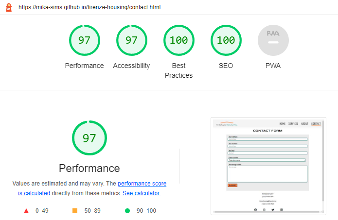
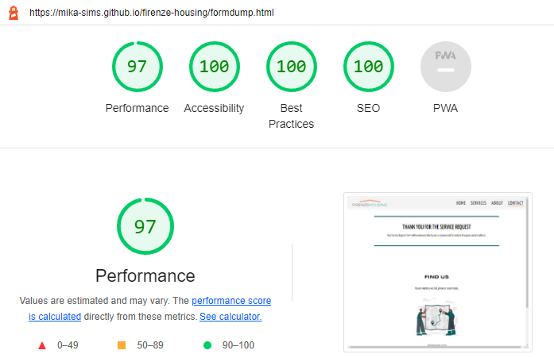

# Testing

  The website has been extensively tested. The following tests were applied during the development.

- [Code Validation](#code-validation)
    * [W3C HTML Validator](#w3c-html-validator) 
        + [Home Page](#home-page)
        + [Services Page](#services-page)
        + [Contact Page](#contact-page)
        + [Formdump Page](#formdump-page)
    * [W3C CSS Validator](#w3c-css-validator)
- [Lighthouse](#lighthouse)
- [Responsiveness](#responsiveness)
- [Color Contrast Accessibility Validator](#color-contrast-accessibility-validator)
- [Cross-Browser Testing](#cross-browser-testing)
- [Testing User Stories](#testing-user-stories)
    * [Prospective Visitors](#prospective-visitors)
    * [Website Owners](#website-owners)
- [Peer Review](#peer-review)
- [Bugs](#bugs)
    * [Resolved](#resolved)
    * [Unresolved](#unresolved)

## Code Validation

All the HTML and CSS codes have been tested in the [W3C html Validator](https://validator.w3.org/) and the [W3C CSS Validator](https://jigsaw.w3.org/css-validator/). There was a minor bug in the contact.html file and it was easily fixed. Details are in the debugging section.

### W3C HTML Validator

The main page, services page, contact form page and formdump page have been tested in the W3C HTML validator and below are the screenshots showing the test results.

* Home page

* Services page

* Contact form page

* Formdump page

### W3C CSS Validator

An external stylesheet file is used for all HTML files. Below is the result of the W3C CSS Validator.

## Lighthouse

All pages of the website have been tested separately by Google DevTools' Google Lighthouse tool to learn the Performance, Accessibility, Best Practices and SEO test results for both mobile and desktop. Below are the test results according to the pages.

**Mobile Test Results**

* Home Page

---

* Services Page

---

* Contact Page

---

* Formdump Page

---
---

**Desktop Test Results**

* Home Page

---

* Services Page

---

* Contact Page

---

* Formdump Page

## Responsiveness

The responsive design tests were carried out manually with [Google Chrome DevTools](https://developer.chrome.com/docs/devtools/).

|        | iPhone 4 | iPhone 5/SE | iPhone 5 | iPhone 6/7/8 | Galaxy S8 | Galaxy S III | Galaxy S9+ | Lumia 520 |
|--------|----------|-------------|----------|--------------|-----------|--------------|------------|-----------|
| Render | passed   | passed      | passed   | passed       | passed    | passed       | passed     |passed     |
| Images | passed   | passed      | passed   | passed       | passed    | passed       | passed     |passed     |
| Links  | passed   | passed      | passed   | passed       | passed    | passed       | passed     |passed     |
